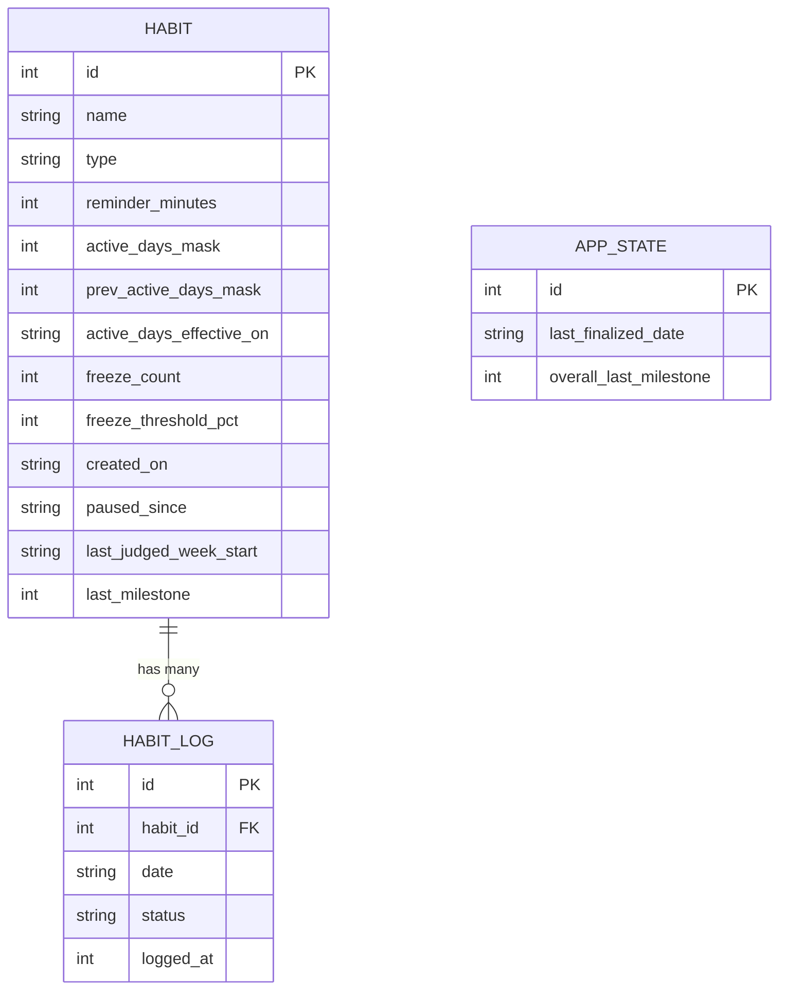

# Habit Streak App: Data Model (v1.1)

Based on SRD v1.5. v1.1 fixes the defects found when the v1.0 rules were run against test scenarios (see the end of section 4). This document gives the model, then the reasoning behind every choice, so you can study it, challenge it, and change it.

---

## 1. The big picture

The app has **three tables**:

| Table | What it is | Rows |
|---|---|---|
| `habit` | A thing you want to do or avoid, with its settings | A handful |
| `habit_log` | What happened to one habit on one day | One per habit per day |
| `app_state` | A tiny single-row table of bookkeeping | Exactly 1 |

Everything else (current streak, longest streak, overall daily streak, completion rates, the calendar) is **calculated from the logs**, not stored.

---

## 2. Table definitions

### 2.1 `habit`

| Column | Type | Rules | Why it exists |
|---|---|---|---|
| `id` | INTEGER PK | auto-generated | Every row needs a unique identity; logs point to it |
| `name` | TEXT | not null | FR-1 |
| `type` | TEXT | `POSITIVE` or `NEGATIVE` | FR-1; decides which buttons and rules apply |
| `reminder_minutes` | INTEGER | 0 to 1439 (minutes since midnight) | FR-15; 21:30 is stored as 1290 |
| `active_days_mask` | INTEGER | 1 to 127 (7-bit mask), at least one day | FR-1; Mon=1, Tue=2, Wed=4, Thu=8, Fri=16, Sat=32, Sun=64 |
| `prev_active_days_mask` | INTEGER | nullable | The mask in force before the latest edit, so earlier days keep the rule they had (see 4.12) |
| `active_days_effective_on` | TEXT (date) | nullable | The date the latest edit took effect (see 4.12) |
| `freeze_count` | INTEGER | 0 to 3, default 0 | FR-11, FR-12, FR-13 |
| `freeze_threshold_pct` | INTEGER | 50 to 100, default 80 | FR-28 |
| `created_on` | TEXT (date `YYYY-MM-DD`) | not null | FR-30 (was this week partial?) and where history starts |
| `paused_since` | TEXT (date) | null = not paused | FR-3, FR-30 |
| `last_judged_week_start` | TEXT (date, a Monday) | nullable | Prevents judging a week twice (see 4.5) |
| `last_milestone` | INTEGER | 0, 50, 100, or 150 | FR-25; remembers which celebration was already shown |

### 2.2 `habit_log`

| Column | Type | Rules | Why it exists |
|---|---|---|---|
| `id` | INTEGER PK | auto-generated | Identity |
| `habit_id` | INTEGER FK | references `habit(id)`, **ON DELETE CASCADE** | Which habit this belongs to; cascade makes FR-4 (delete wipes history) automatic |
| `date` | TEXT (date `YYYY-MM-DD`) | not null | Which day, in local time |
| `status` | TEXT | see below | What happened |
| `logged_at` | INTEGER (epoch ms) | nullable | When you tapped. **Null means the system wrote the row.** The weekly rate relies on this (see 4.7) |

**Constraint:** `UNIQUE(habit_id, date)`. One habit can have only one row per day.

**Status values:**

| Status | Meaning | Who writes it |
|---|---|---|
| `DONE` | Positive habit completed | You (tap Done) |
| `CLEAN` | Negative habit, no slip | You (tap No), or the system if you never answered (then `logged_at` stays empty) |
| `SLIPPED` | Negative habit, you slipped | You (tap Yes) |
| `MISSED` | Positive habit not done | System at finalization |
| `FROZEN` | A miss or slip covered by a freeze | System at finalization |
| `NOT_ACTIVE` | The habit doesn't apply that weekday | System at finalization |
| `PAUSED` | The habit was paused that day | System |
| `BONUS` | Positive habit done on a day it wasn't scheduled | You |

A day with **no row** is *pending*: it hasn't happened yet or hasn't been finalized.

### 2.3 `app_state`

A single row (`id = 1`).

| Column | Type | Why it exists |
|---|---|---|
| `last_finalized_date` | TEXT (date) | The bookmark for catch-up (see 4.1) |
| `overall_last_milestone` | INTEGER | Same idea as `habit.last_milestone`, for the overall daily streak |

---

## 3. What is calculated, not stored

| Value | How it is derived |
|---|---|
| **Current streak** (per habit) | Walk back from today. `DONE`, `BONUS`, and `CLEAN` add 1. `FROZEN` keeps the streak alive but adds nothing. `NOT_ACTIVE`, `PAUSED`, and pending days are skipped. `MISSED` and `SLIPPED` stop the walk. **Display rule for negative habits:** a pending scheduled day with no row counts as provisionally clean (+1), because silence means the counter keeps running. |
| **Longest streak** (per habit) | The same walk across the full history, keeping the best run |
| **Overall daily streak** | For each date: it is *completed* if any positive habit has `DONE` or `BONUS`, and *scheduled* if any positive habit has `DONE`, `MISSED`, or `FROZEN`. Walk back: completed adds 1, scheduled but not completed breaks the streak, and anything else (nothing scheduled, or pending) is skipped. |
| **Weekly completion rate** | Numerator: `DONE` rows plus `CLEAN` rows where `logged_at` is not null. Denominator: all rows except `NOT_ACTIVE`, `PAUSED`, and `BONUS`. If the denominator is 0, the week is skipped. |
| **Calendar grid** | Just the logs for that habit and month |

---

## 4. Reasoning: why it's built this way

### 4.1 Two real entities, because nouns and events are different
`habit` is a thing that *exists*. `habit_log` is something that *happened*. The SRD is mostly about the second kind (done, missed, slipped, frozen), and a single table can't hold 19 days of history for the calendar (FR-20). That's why the first draft with only `habit` couldn't work.

### 4.2 Store one row for every day, including boring ones
Rows like `NOT_ACTIVE` and `PAUSED` look wasteful, but they do two jobs:

1. **History must not change when settings change.** If you edit active days from Mon/Wed/Fri to every day, old weeks must still be judged by the rules in force *then*. If `NOT_ACTIVE` were calculated from the current setting, editing it would rewrite the past.
2. **They make the weekly rate simple.** The denominator is just "rows that aren't `NOT_ACTIVE` or `PAUSED`."

The cost is tiny: a habit makes about 365 rows a year.

### 4.3 Derive streaks instead of storing them
A stored `current_streak` number can disagree with the logs, and "fix yesterday" (FR-19) would force you to recompute and patch it. If streaks are calculated from logs, they are always correct, and fixing a day automatically fixes the streak. The price is a short loop over the history, which is trivial on a phone at this scale. If it ever gets slow, a stored cache can be added later without changing the logs.

### 4.4 Active days as a column, not a table
Compare it to the three questions from earlier: only 7 possible values, no details of their own, and each belongs to exactly one habit and is never queried alone. That makes it an attribute. A bitmask integer is compact and quick to check (`mask and (1 shl weekdayIndex) != 0`). The alternative, a `habit_active_day(habit_id, weekday)` table, is more "textbook" but adds a join for no benefit here. In Kotlin you can also wrap it in a TypeConverter and expose it as `Set<DayOfWeek>`.

### 4.5 `freeze_count` is stored; `last_judged_week_start` prevents double awards
Unlike streaks, the freeze count depends on *history of spending and earning*, which is awkward to rebuild, so storing the number (0 to 3) is sensible. The risk of a plain counter is the "award the same week twice" bug, so `last_judged_week_start` records the newest week already judged. The weekly check runs only for weeks after that date.

### 4.6 Finalization delay: why a day is not final until two days later
FR-19 lets you fix yesterday. If the app spent a freeze at midnight and you then fixed the day, you would need to refund it. To avoid refunds:

> A day is **finalized** only when it is older than yesterday (date <= today - 2).

Until then it stays *pending*, you can edit it, and it neither counts nor breaks a streak. Freeze spending and weekly judging happen only at finalization, so there is nothing to undo.

**Finalization routine** (per habit, per unfinalized date D, starting after `last_finalized_date` and never before `created_on`). The order matters:

1. **If a row already exists for D, keep it.** The only change allowed: a `SLIPPED` row becomes `FROZEN` (and `freeze_count` drops by 1) if a freeze is available. If none is, reset `last_milestone` to 0. Stop.
2. Else if the habit was paused on D, write `PAUSED`.
3. Else if D's weekday is not in the mask that applied on D (see 4.12), write `NOT_ACTIVE`.
4. Else, for a positive habit: if `freeze_count > 0` write `FROZEN` and subtract 1, otherwise write `MISSED` and reset `last_milestone` to 0. For a negative habit: write `CLEAN` with `logged_at` empty.

Checking for an existing row **first** (step 1) fixes a crash found in testing: in v1.0 the routine tried to write `NOT_ACTIVE` or `PAUSED` over a day that already had a row, and the database's uniqueness rule rejected it on every launch.

Run it when the app opens (before anything else) and from a daily background job. It works from `last_finalized_date`, so it catches up even if the phone was off for days. That also covers the reboot concern in NFR-4.

### 4.7 Weekly freeze judging
When a Sunday is finalized, for each habit whose `last_judged_week_start` is before that week's Monday:

1. **Skip** the week if it is partial (FR-30): `created_on` is after that Monday, or any day in the week is `PAUSED`.
2. Count the denominator: rows other than `NOT_ACTIVE`, `PAUSED`, and `BONUS`. If it is 0, skip the week.
3. Count the numerator: `DONE` rows, plus `CLEAN` rows **that you answered** (`logged_at` is not null). `FROZEN`, `MISSED`, `SLIPPED`, and silent (system-written) `CLEAN` rows count as not completed.
4. If `numerator * 100 >= freeze_threshold_pct * denominator` and `freeze_count < 3`, add 1. Integer math avoids rounding surprises.
5. Set `last_judged_week_start` to that Monday.

Why `logged_at` matters: in v1.0 a negative habit you never answered counted as `CLEAN` and earned a freeze every week with zero effort (testing showed 3 freezes after 4 silent weeks). Your streak still keeps running on silence, but freezes now require you to actually confirm.

### 4.8 `paused_since` instead of a plain `is_paused`
A boolean can't tell the app *when* the pause began, and FR-30 and the finalization routine need dates. `paused_since` is both the flag (null means not paused) and the start date. Pausing and resuming both take effect today. On resume, the app writes `PAUSED` for each day from `paused_since` up to yesterday that is still unfinalized and has no row (finalized days already got `PAUSED` from the routine), then sets the field back to null. A day that already has a row, such as a `DONE` logged before you paused, is never overwritten.

### 4.9 Cascade delete
`ON DELETE CASCADE` on `habit_log.habit_id` means deleting a habit removes all its logs in one operation, which is exactly FR-4 (a permanent wipe).

### 4.10 Dates are local dates; times are minutes
Days are stored as plain `YYYY-MM-DD` strings in the phone's local time, with no time zone attached, matching the midnight cutoff (FR-7). Reminder times are minutes since midnight. Both avoid time zone bugs.

### 4.11 Ready for the v2 AI coach
The coach would need history, and everything is already there: `habit_log` gives it a full day-by-day record, `logged_at` shows *when* you tend to act, and `created_on` gives each habit's age. Its tools (create, edit, pause) can call the same repository functions as your screens, so no new tables are needed.

### 4.12 Edits take effect from today
If an edit to active days applied to every pending day, the app would judge yesterday under a rule that didn't exist yesterday. Testing showed exactly that: a freeze was spent on a Tuesday that wasn't scheduled when the edit was made. The fix keeps one previous version of the mask:

- **Run finalization before applying any edit.** That leaves at most yesterday and today pending.
- **On edit:** if `active_days_effective_on` is not today, copy the current mask into `prev_active_days_mask`. Then store the new mask and set `active_days_effective_on` to today.
- **When judging a date D:** use `prev_active_days_mask` if `active_days_effective_on` is set and D is before it; otherwise use `active_days_mask`.

One previous version is enough because of the first rule.

### 4.13 Rules the database and the app enforce
- **CHECK constraints:** `freeze_count` 0 to 3, `freeze_threshold_pct` 50 to 100, `active_days_mask` 1 to 127, `status` limited to the listed values.
- **UNIQUE** `(habit_id, date)`.
- Logging is allowed only for today and yesterday, and never before `created_on`.
- Logging a positive habit as done on a day it isn't scheduled writes `BONUS` (FR-31). Negative habits have no bonus days.
- Pass today's date into every function that needs it, never read the clock inside the logic. That makes midnight and week-boundary rules testable.

### 4.14 What changed from v1.0, and why
| Found in testing | Fix |
|---|---|
| Finalizer crashed on a day that already had a row | Check for an existing row first (4.6), add `BONUS` for non-scheduled days |
| Editing active days judged pending days under the new rule | `prev_active_days_mask` and `active_days_effective_on` (4.12) |
| Overall streak broke on days with nothing scheduled | Completed / scheduled / skip rule (section 3) |
| Negative counter lagged two days | Pending scheduled days count as provisionally clean (section 3) |
| Silent negative habits earned freezes | Only answered `CLEAN` counts toward the rate (4.7) |
| Division by zero in a week with no countable days | Skip the week (4.7), require one active day (4.13) |

---

## 5. SRD traceability

| Requirement | Where it lives |
|---|---|
| FR-1, FR-2 | `habit` columns |
| FR-3, FR-30 | `paused_since`, `created_on`, `PAUSED` logs |
| FR-2, FR-32 | `prev_active_days_mask`, `active_days_effective_on` |
| FR-4 | `ON DELETE CASCADE` |
| FR-5, FR-6, FR-31 | `DONE`, `CLEAN`, `SLIPPED`, `BONUS` |
| FR-7 | Local `date` strings |
| FR-8, FR-9, FR-10 | Streak derivation (section 3) |
| FR-11 to FR-14 | `freeze_count`, `FROZEN`, weekly judging (4.7) |
| FR-15 to FR-18 | `reminder_minutes`, scheduler (design stage) |
| FR-19 | Finalization delay (4.6) |
| FR-20 to FR-22 | `habit_log` and `freeze_count` |
| FR-26, FR-27 | Derived from logs |
| FR-25 | `last_milestone`, `overall_last_milestone` |
| FR-28, FR-29 | `freeze_threshold_pct` |

---

## 6. Things to watch, and gaps to decide

1. **Pending days on positive habits.** A pending yesterday neither counts nor breaks the streak. Decide how the screen shows it (for example, an "unconfirmed" marker).
2. **Threshold edits during the judging lag.** A week ending Sunday is judged on Tuesday, so lowering the threshold on Monday would apply to last week. Options: apply threshold edits from the next Monday, or snapshot the threshold per week. Decide in design.
3. **Deleting a habit changes the overall daily streak.** It is derived from logs, so wiping a habit's logs can shrink it. Options: accept it, or store a small `daily_summary` table.
4. **Milestones for the overall streak.** FR-25 says "a streak." This model supports both per-habit and overall milestones. Confirm you want both.
5. **Time zones and travel.** Days are local dates, so changing time zone can repeat or skip a day. Probably acceptable for v1.
6. **Phone off for days.** Only yesterday is editable, so days you did the habit but never logged become `MISSED` or `FROZEN`. The notification buttons let you log without opening the app, which softens this.

---

## 7. Test it yourself

These scenarios were run against the v1.1 rules in a small simulation, and all 15 checks pass. Run them on paper too, and try to break them:

1. Done every day for 8 days, then one miss with 0 freezes. Expect `MISSED`, current streak 0, longest 8.
2. A miss with 1 freeze. Expect `FROZEN`, `freeze_count` 0, and the streak continues without adding a day.
3. Forget Tuesday, fix it on Wednesday. Expect `DONE` and nothing to refund.
4. Pause on Wednesday, resume the next Tuesday. Expect `PAUSED` rows and no freeze judged for those weeks.
5. Change active days from Mon/Wed/Fri to every day on a Wednesday. Expect Tuesday to stay `NOT_ACTIVE`.
6. Phone off for 4 days. Expect the catch-up to write the missing days in order.
7. 4 of 5 active days at an 80% threshold earns a freeze, and already holding 3 stays at 3.
8. A Mon/Wed/Fri habit done perfectly keeps the overall streak alive across the off days, and a missed Friday breaks it.
9. A negative habit you never answer shows its full running count but earns no freezes.
10. Log on a day the habit isn't scheduled. Expect `BONUS`, and no crash during finalization.
11. Pause on a day you already logged. Expect the `DONE` row is kept.
12. A judged week with no countable days is skipped without error.

If you find a scenario the model gets wrong, that's a defect to fix in the design.
